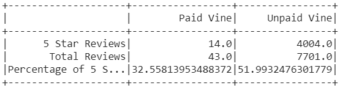

# Amazon Vine Analysis

## Overview

The purpose of conducting this analysis was to investigate any bias for favourable ratings and reviews between members of the Amazon Vine program, a paid program, and regular consumers of watches sold on the platform.

To conduct said analysis, we are using PySpark to search the available datasets for reviews to undergo ETL.

### Results
From our analysis, we compute the number of 5 star ratings being given by both demographics against the totals, and produce the following table:

We see a few things being surmised about Amazons Watch reviewers:
* There are a total of 43 Vine members and 7701 non-Vine members who have left reviews
* 14 reviews from Vine members were 5 stars while 4004 non-Vine members left 5 star ratings
* The percentage of 5 star reviews left by Vine members was 32.55% whilst non-Vine members left 51.99% of 5 star ratings for watches

### Summary
Based on our collected data, we can say that there is no positivity bias from Vine members, as majority of 5 star reviews come from non-members. To further support this, we could look at all star raitings and compare them to confirm the above statement, as well as perhaps prove that there might be a negativity bias from Vine members amongst the Watch-purchasing community.
